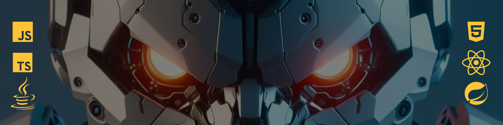

# Olá ,eu sou o João ✌️

 Desenvolvedor FrontEnd / FrontEnd Developer 

## Habilidades e tecnologias que estou estudando 

 
 
 
 
 
 

###

## Contato:

E-mail: jmmsp2003@hotmail.com

Tel:(75)98827-5212 (whatsapp)

<h2 align="center">Never stop learning🚀</h2>
